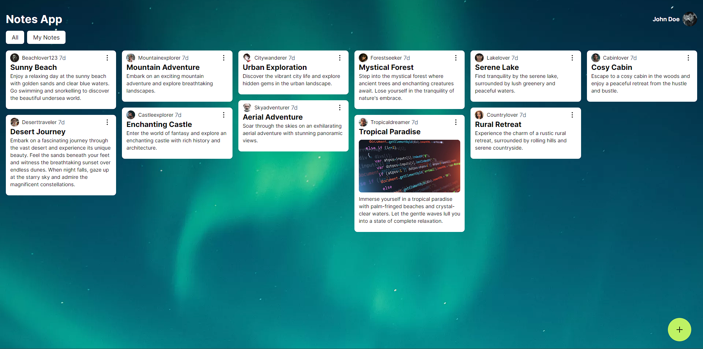

# Notes App - Application to Create Notes

The **Notes App** is a simple application for creating and managing notes. It is designed with Next.js and uses Tailwind CSS for visual design. This application is frontend only, meaning it does not have a backend or data persistence functionality.



## Characteristics

- Create new notes easily.
- Edit the content of existing notes.
- Delete notes you no longer need.

## How to use

1. **Clone the Repository:**
   
    ```bash
    git clone https://github.com/jairayafranco/notes-app.git
    cd notes-app
    ```

2. Install dependencies `npm install`

3. Start the `npm run dev` application

4. The application will run on `http://localhost:3000`. Open your browser and visit this URL to see the application working.
